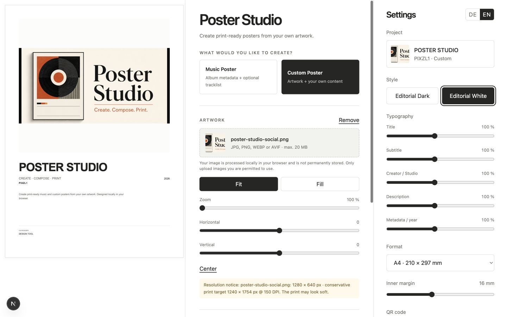
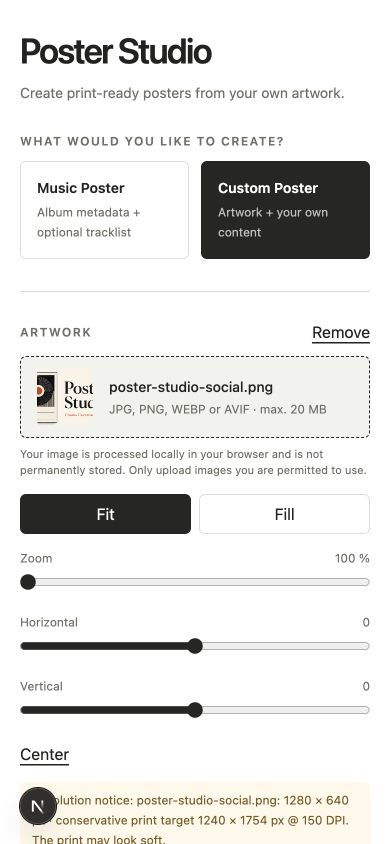
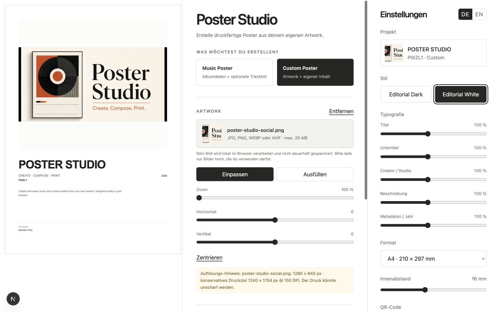
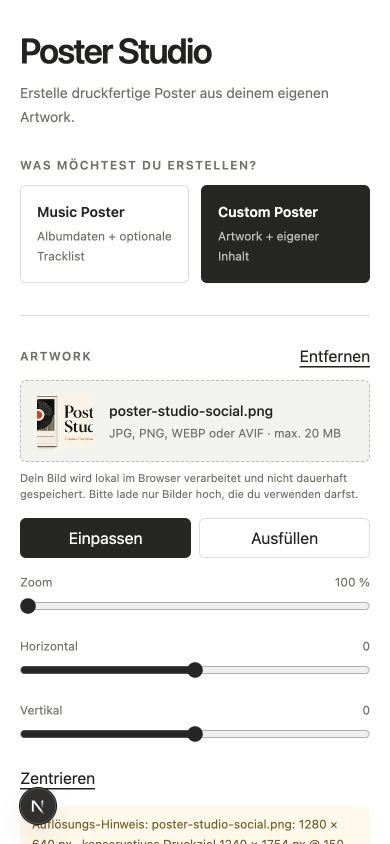

# Poster Studio

Poster Studio is a source-available Next.js application for creating print-ready posters from artwork supplied by the user. It provides two first-class workflows:

- **Music Poster** — manually enter album data or optionally import metadata and tracklists from MusicBrainz.
- **Custom Poster** — create gaming, movie, series, book, fan-art, photography, event, or personal posters without an external metadata service.

Artwork is processed locally in the browser. The application does not upload it, persist it, search for it, or retrieve copyrighted images from third-party artwork services.



<p align="center">
  
</p>

<details>
  <summary>German interface</summary>
  <br />
  
  <p align="center">
    
  </p>
</details>

## Highlights

- Local JPG, PNG, WEBP, and AVIF artwork with MIME, size, decode, and dimension validation
- Reusable artwork editor with fit/fill, zoom, centering, and two-axis repositioning
- Non-blocking print-quality feedback based on image dimensions, physical format, and DPI
- MusicBrainz metadata search with release ranking, request throttling, timeout, retry, caching, and typed errors
- Fully manual music workflow and editable imported tracklists
- Row editing, deletion, drag reordering, and bulk-text track import
- Dedicated `MusicPosterContent` and `CustomPosterContent` models in a discriminated `PosterProject` union
- Five visible music styles, with additional work-in-progress templates retained in the registry, plus **Editorial Dark** and **Editorial White** for Custom posters
- Optional scan-ready QR codes generated locally from a user-provided music-service link
- One canonical SVG rendering pipeline for live preview, PNG, and exact-page-size PDF
- A4, A3, 30×40 cm, 40×50 cm, 50×70 cm, and US Letter at 150 or 300 DPI
- Strict TypeScript, ESLint, Prettier, Vitest, Docker, and no required paid service

## Architecture

```text
Browser
  ├─ local File / Blob URL ─ ArtworkEditor ─ ArtworkSettings
  ├─ Music mode ─ optional /api/albums/* ─ MusicProvider ─ MusicBrainz
  └─ Custom mode ─ local content only

PosterProject (music | custom)
  └─ template registry ─ canonical SVG
                         ├─ live preview
                         ├─ exact-DPI PNG
                         └─ exact-size PDF
```

The UI never imports MusicBrainz response types. API responses are normalized into provider-neutral album and track models. Artwork transformations are pure SVG calculations shared by preview and export.

## Artwork and privacy

The artwork picker accepts JPG/JPEG, PNG, WEBP, and AVIF. `NEXT_PUBLIC_ARTWORK_MAX_FILE_MB` configures the maximum file size. Files are decoded in the browser, represented by a temporary object URL, embedded into the exported document in the browser, and released when replaced or when the application closes.

No artwork upload endpoint, remote artwork proxy, database, or cloud-storage integration is included. Users are responsible for ensuring they have permission to use uploaded content.

## Music Poster workflow

1. Upload artwork from the local device.
2. Search MusicBrainz or enter album data manually.
3. Import or manually create a tracklist.
4. Edit names and durations, add/delete tracks, drag to reorder, or import text.
5. Choose a music template, print format, margin, options, and DPI.
6. Export PNG or PDF.

MusicBrainz supplies metadata only: title, artist, release date/year, release type, tracks, and available durations. Selecting a release never changes the user’s artwork.

## Custom Poster workflow

1. Upload local artwork.
2. Enter any combination of title, subtitle, creator/studio/publisher, category, year, description, and label/value metadata.
3. Choose **Editorial Dark** or **Editorial White** and configure format, margin, artwork framing, and DPI.
4. Export PNG or PDF.

Gaming, movies, series, books, fan art, photography, events, and personal work are content categories on top of the same Custom architecture—not separate rendering systems.

## Local development

Requirements: Node.js 22.13+ and npm.

```bash
npm install
cp .env.example .env.local
npm run dev
```

Open `http://localhost:3000`. Before a public deployment, configure a truthful MusicBrainz User-Agent and maintainer contact.

## Environment variables

| Variable                          | Default                     | Purpose                                |
| --------------------------------- | --------------------------- | -------------------------------------- |
| `APP_NAME`                        | Poster Studio               | Application/User-Agent name            |
| `APP_URL`                         | localhost                   | Canonical deployment URL               |
| `MUSICBRAINZ_ENABLED`             | true                        | Optional metadata lookup               |
| `MUSICBRAINZ_USER_AGENT`          | development fallback        | Complete MusicBrainz User-Agent        |
| `MUSICBRAINZ_CONTACT_EMAIL`       | invalid development address | Maintainer contact fallback            |
| `MUSIC_PROVIDER`                  | musicbrainz                 | Server-side metadata provider          |
| `CACHE_PROVIDER`                  | memory                      | Cache adapter selection                |
| `RATE_LIMIT_PROVIDER`             | memory                      | API limiter adapter selection          |
| `TRUST_PROXY_HEADERS`             | false                       | Trust verified proxy client-IP headers |
| `NEXT_PUBLIC_ARTWORK_MAX_FILE_MB` | 20                          | Local artwork file-size limit          |

## Commands

```bash
npm run dev
npm run lint
npm run typecheck
npm test
npm run build
npm start
npm run format
```

## MusicBrainz etiquette

All MusicBrainz traffic is server-side. Every attempt, including retries, passes through the shared throttled scheduler. Requests use a bounded timeout, exponential backoff, `Retry-After` handling, runtime response validation, and cache TTLs. Search results are ranked and deduplicated to favor original official album releases and useful track data.

For horizontally scaled production, add Redis-compatible implementations of the existing cache and rate-limit interfaces and a distributed MusicBrainz request scheduler.

### Optional MusicBrainz integration

MusicBrainz is enabled by default and is used only for music metadata and track information; artwork is always supplied by the user. Music Posters can also be created entirely manually, and Custom Poster mode does not require MusicBrainz. Self-hosted operators can set `MUSICBRAINZ_ENABLED=false` to disable the external integration and should respect MusicBrainz's applicable usage policies when it is enabled.

## Extending Poster Studio

### Add a music template

Create an isolated component under `templates/<name>/`, accept the shared music template props, render pure SVG, register it in `MUSIC_POSTER_TEMPLATES`, and add a deterministic rendering test.

### Add a Custom template

Create a component accepting `CustomPosterTemplateProps`, reuse `PosterArtwork`, register it in `CUSTOM_POSTER_TEMPLATES`, and keep all rendering inside the canonical SVG pipeline.

### Add a Custom preset or category

A preset should provide initial `CustomPosterContent` values or template settings. Do not add a separate domain or export architecture for games, films, books, or events.

### Add a metadata provider

Implement `MusicProvider`, normalize results into the provider-neutral music types, select it on the server, and add contract tests. UI components and poster templates must remain provider-independent.

## Docker and deployment

```bash
cp .env.example .env
docker compose up --build
```

The multi-stage image builds Next.js standalone output and runs as a non-root user on port 3000. The app can be deployed on any compatible Node.js host and requires no database or paid API.

### Install locally on Windows, macOS, or Linux

For a beginner-friendly installation using Docker, including English and German instructions, see the **[local installation guide](./docs/LOCAL_INSTALLATION.md)**. The guide covers installation, first start, updates, removal, and common problems without requiring programming knowledge.

### Install on Unraid — beginner-friendly

Poster Studio is provided as a ready-to-run Unraid image. You do not need to download the source code, install Node.js, or compile anything.

Before you begin, make sure Docker is enabled in Unraid under **Settings → Docker**.

1. In the Unraid web interface, click the **Terminal** icon (`>_`) in the top-right corner.
2. Copy the complete block below, paste it into the terminal, and press **Enter**:

   ```bash
   mkdir -p /boot/config/plugins/dockerMan/templates-user
   wget -O /boot/config/plugins/dockerMan/templates-user/my-poster-studio.xml https://raw.githubusercontent.com/Pixzl1/poster-studio/main/unraid/poster-studio.xml
   ```

3. Close the terminal and open the **Docker** page.
4. Click **Add Container**.
5. Open the **Template** list and select **Poster Studio** under **User templates**.
6. Keep the default settings and click **Apply**. Unraid now downloads and starts Poster Studio automatically.
7. When the installation is complete, click the Poster Studio icon and select **WebUI**.

The app normally opens at `http://YOUR-UNRAID-IP:3000`. You do not need to enter this address manually when using the **WebUI** button. If port `3000` is already used by another container, choose a different **WebUI Port** before clicking **Apply**.

No storage path is required: uploaded artwork stays in the user's browser and is not stored inside the container or on the Unraid server.

#### Updating Poster Studio

Open Unraid's **Docker** page and click **Check for Updates**. If an update is available, click **Update** next to Poster Studio. New images are built automatically from the current `main` branch and published as `ghcr.io/pixzl1/poster-studio:latest`.

<details>
  <summary><strong>Deutsche Installationsanleitung</strong></summary>
  <br />

Poster Studio wird als fertiger Unraid-Container bereitgestellt. Du musst weder den Quellcode herunterladen noch Node.js installieren oder etwas selbst kompilieren.

Prüfe zunächst unter **Einstellungen → Docker**, ob Docker in Unraid aktiviert ist.

1. Klicke oben rechts in der Unraid-Oberfläche auf das **Terminal-Symbol** (`>_`).
2. Kopiere den folgenden vollständigen Block, füge ihn in das Terminal ein und drücke **Enter**:

   ```bash
   mkdir -p /boot/config/plugins/dockerMan/templates-user
   wget -O /boot/config/plugins/dockerMan/templates-user/my-poster-studio.xml https://raw.githubusercontent.com/Pixzl1/poster-studio/main/unraid/poster-studio.xml
   ```

3. Schließe das Terminal und öffne die Seite **Docker**.
4. Klicke auf **Add Container**.
5. Öffne die Liste **Template** und wähle unter **User templates** den Eintrag **Poster Studio** aus.
6. Behalte die voreingestellten Werte bei und klicke auf **Apply**. Unraid lädt und startet Poster Studio nun automatisch.
7. Klicke nach Abschluss der Installation auf das Poster-Studio-Symbol und anschließend auf **WebUI**.

Poster Studio ist normalerweise unter `http://DEINE-UNRAID-IP:3000` erreichbar. Über den **WebUI**-Button musst du diese Adresse nicht selbst eingeben. Falls Port `3000` bereits von einem anderen Container verwendet wird, wähle vor **Apply** einen anderen **WebUI Port**.

Ein Speicherpfad ist nicht erforderlich: Hochgeladene Bilder verbleiben im Browser des Benutzers und werden weder im Container noch auf dem Unraid-Server gespeichert.

**Updates:** Öffne die Unraid-Seite **Docker** und klicke auf **Check for Updates**. Wird eine neue Version angezeigt, klicke bei Poster Studio auf **Update**.

</details>

## Known limitations

- Browser memory limits very large 300 DPI exports.
- PDF pages contain the high-resolution poster raster; text is not separately selectable vector text.
- Object URLs intentionally do not survive a closed browser session.
- Touch-friendly row controls are available, while freeform drag behavior depends on the browser.
- The default cache, rate limiter, and request scheduler are process-local.
- Custom mode currently includes Editorial Dark and Editorial White.

## Support Poster Studio

Poster Studio is available for noncommercial use. If the project is useful to you, you can optionally support its continued development:

[](https://ko-fi.com/pixzl1)
[](https://buymeacoffee.com/pixzl1)

## Feedback and license

Bug reports and feature suggestions are welcome as described in [CONTRIBUTING.md](./CONTRIBUTING.md). Code contributions are not currently accepted.

Copyright © 2026 [Pixzl1](https://github.com/Pixzl1). Poster Studio is source-available under the [PolyForm Strict License 1.0.0](./LICENSE): noncommercial use is permitted, while distributing the software or making changes or new works based on it is not. See [COPYRIGHT.md](./COPYRIGHT.md) for the concise notice and the `LICENSE` file for the complete controlling terms.
